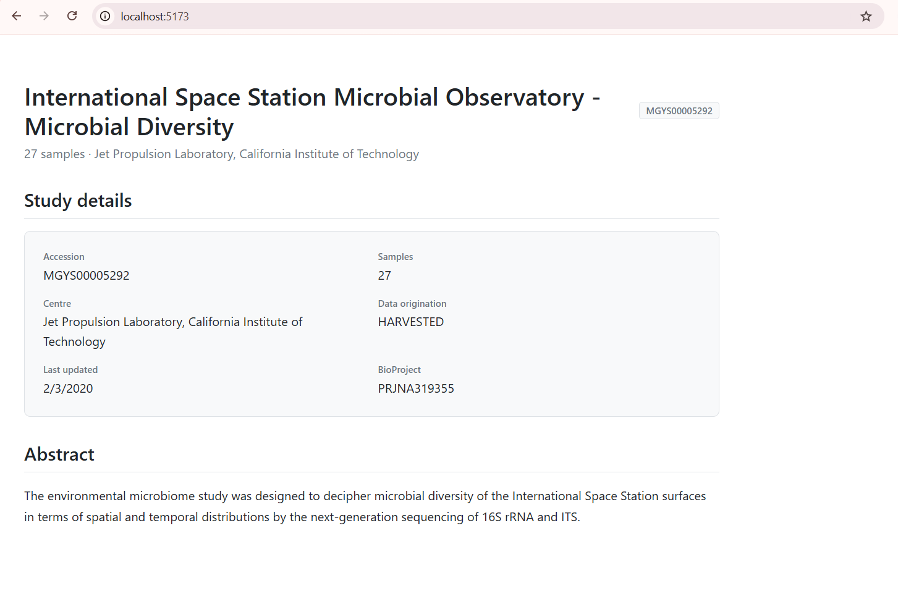

# MGnify MCP PoC - Design and API-Aware UI Generation

A working proof of concept for project:  
**"Design and API-Aware UI Generation Using MCP Servers and Figma APIs"**  
Organisation: EMBL-EBI MGnify

---

## What this is

This MVP demonstrates a context-rich code generation pipeline where:

- **Field names** come from live MGnify API schemas - not assumed
- **Layouts** come from Figma design tokens - not hardcoded
- **Hook patterns** come from frontend convention tools - not invented

It proves the core claim of the proposal: an LLM given authoritative, structured context across all three layers generates more accurate, consistent UI components than one relying on training data alone.

---

## Demo Image
<p align="center">
  
</p>
---

## Project Structure

```
prac_comp/
├── mcp-server/                  # MCP server - core of the PoC
│   ├── index.js                 # 9 MCP tools across 3 categories
│   ├── package.json
│   └── data/
│       ├── figma-tokens.json    # Mock Figma design tokens + component specs
│       ├── patterns.json        # Frontend fetch hook templates
│       └── schema-snapshots/    # Stored API schemas for drift detection
│           ├── studies.json
│           ├── samples.json
│           ├── analyses.json
│           └── runs.json
├── scripts/
│   ├── test-tools.js            # Runs all 9 MCP tools and prints results
│   └── detect-drift.js          # Compares live API against stored snapshots
├── server/
│   └── server.js                # Express proxy + Claude API integration
├── client/
│   └── src/
│       ├── pages/
│       │   └── StudyDetailPage.jsx   # Generated page using MCP tool outputs
│       ├── components/
│       │   └── Table.jsx             # Reusable table with field normalisation
│       ├── services/
│       │   ├── api.js
│       │   └── resourcemap.js
│       └── App.jsx
└── README.md
```

---

## MCP Tools Implemented

### API Schema Tools
Answer: *"What data is available and in what shape?"*

| Tool | Description |
|---|---|
| `list_api_resources()` | Returns all MGnify endpoints grouped by resource type |
| `get_endpoint_schema(path)` | Fetches live API and returns compact typed schema |
| `get_pagination_info(resource)` | Returns JSON:API cursor pagination details |

### Figma Tools
Answer: *"What should this component look like?"*

| Tool | Description |
|---|---|
| `get_design_tokens()` | Returns colours, spacing, typography from Figma mock |
| `get_component_spec(name)` | Returns layout rules and props for a named component |
| `list_figma_components()` | Lists all available components in the design system |

### Convention Tools
Answer: *"How does MGnify's frontend write code?"*

| Tool | Description |
|---|---|
| `get_fetch_pattern(resource)` | Returns canonical SWR hook template for a resource |
| `get_component_conventions()` | Returns file naming, hook location, import rules |
| `list_shared_hooks()` | Lists reusable hooks already in the codebase |

---

## Getting Started

### Prerequisites

- Node.js 18 or above
- npm

### 1. Clone the repository

```bash
git clone https://github.com/SA0806/mgnify-mcp-poc
cd mgnify-mcp-poc
```

### 2. Install MCP server dependencies

```bash
cd mcp-server
npm install
cd ..
```

### 3. Install root dependencies

```bash
npm install
```

### 4. Set up environment variables

Create a `.env` file in `server/`:

```env
ANTHROPIC_API_KEY=your_claude_api_key_here
```

### 5. Start the Express server

```bash
cd server
node server.js
```

### 6. Start the React client

```bash
cd client
npm install
npm run dev
```

---

## Running the Tools

### Test all 9 MCP tools

Runs every tool against live MGnify API and local mock data. No Claude Desktop required.

```bash
node scripts/test-tools.js
```

Expected output:
```
MGnify MCP PoC - Tool Test Runner

TOOL: list_api_resources     ✓ PASSED
TOOL: get_endpoint_schema    ✓ PASSED
TOOL: get_pagination_info    ✓ PASSED
TOOL: get_design_tokens      ✓ PASSED
TOOL: get_component_spec     ✓ PASSED
TOOL: list_figma_components  ✓ PASSED
TOOL: get_fetch_pattern      ✓ PASSED
TOOL: get_component_conventions ✓ PASSED
TOOL: list_shared_hooks      ✓ PASSED

SUMMARY
  Passed: 11
  Total:  11

All tools working. MCP server is proposal-ready.
```

To test a single tool:

```bash
node scripts/test-tools.js get_endpoint_schema
```

---

### Run the schema drift detector

Compares stored API schema snapshots against the live MGnify API.  
Exits with code 1 if any field is added, removed, or changes type - designed to fail CI.

**First run** - saves baseline snapshots:

```bash
node scripts/detect-drift.js
```

**Subsequent runs** - checks for drift:

```bash
node scripts/detect-drift.js
```

**Check a single resource:**

```bash
node scripts/detect-drift.js studies
```

**Update snapshots after reviewing drift:**

```bash
node scripts/detect-drift.js --save
```

---

## Key Technical Details

### Field name normalisation

MGnify's API uses hyphenated field names (`bioproject-title`, `samples-count`).  
LLMs and developers often write underscores instead (`bioproject_title`).

The `getNestedValue()` function in `Table.jsx` normalises both directions:

```js
// Both of these resolve correctly:
getNestedValue(row, "attributes.samples-count")   // direct match
getNestedValue(row, "attributes.samples_count")   // normalised to hyphen
```

The MCP tool schema also explicitly uses hyphenated names so the LLM receives correct field paths before generating any code. Two-layer defence.

### Schema extraction

`get_endpoint_schema()` returns a compact typed representation - not raw API output.  
A full MGnify study response is ~4KB. The tool response is under 500 bytes:

```json
{
  "type": "string",
  "id": "string",
  "attributes": {
    "study-name": "string",
    "samples-count": "number",
    "study-abstract": "string",
    "last-update": "string",
    "is-private": "boolean"
  }
}
```

This keeps tool responses well within the LLM context window budget described in the proposal.

### StudyDetailPage - MCP-grounded component

`src/pages/StudyDetailPage.jsx` demonstrates the end-to-end result.  
Every value in the component traces to a specific tool call:

| Value in code | Source tool |
|---|---|
| `study["study-name"]` | `get_endpoint_schema("/studies")` |
| `study["samples-count"]` | `get_endpoint_schema("/studies")` |
| `colors.primary: "#2c7bb6"` | `get_design_tokens()` |
| `spacing.lg: "24px"` | `get_design_tokens()` |
| `useSWR(accession ? ...)` | `get_fetch_pattern("study")` |
| `PageHeader` layout rules | `get_component_spec("PageHeader")` |

---

## What this PoC proves

1. **All 9 MCP tools work** against the live MGnify API and local mock data
2. **Schema drift detection works** - detects field-level API changes and fails CI
3. **Field names are correct** - `study-name`, `samples-count` sourced from live API, not assumed
4. **Design tokens are applied** - colours and spacing from mock Figma data
5. **The architecture is sound** - Express server, MCP server, and React client are cleanly separated

---

## Relation to Proposal

This MVP was built prior to proposal submission to validate the core technical claims.

| Proposal claim | MVP evidence |
|---|---|
| MCP tools can retrieve live API schemas | `get_endpoint_schema()` hitting `ebi.ac.uk/metagenomics/api/v1` |
| Figma integration pattern is viable | Mock Figma tools reading `figma-tokens.json` |
| Schema drift can be detected automatically | `detect-drift.js` passing 4 resources clean |
| Generated components use correct field names | `StudyDetailPage.jsx` using hyphenated MGnify fields |
| LLM failure modes are handled | Fallback chain in `server.js` |

In the full project, the mock Figma JSON will be replaced with real Figma REST API calls, and the Express server will be replaced with a proper MCP server connected to Claude Desktop.

---

## Author

**Sahiba Joshi**  
B.Tech 2nd Year, IIT Indore  
GitHub: [SA0806](https://github.com/SA0806)  
LinkedIn: [sahiba-joshi](https://www.linkedin.com/in/sahiba-joshi/)  